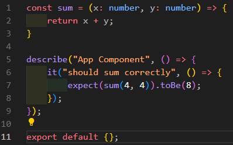
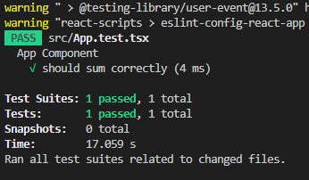

# Testes Automatizados

### O que são testes automatizados?

Testes são uma forma de garantirmos o funcionamento correto do código. Então basicamente a gente verifica se o ciclo de execução do código está correto, e se ele está retornando o que a gente espera que ele retorne.

Como eles são Automatizados, testamos vários cenários com apenas um comando. Por exemplo, vamos supor que estamos trabalhando com uma aplicação grande onde essa aplicação tem várias funcionalidades e a gente quer testar 200 cenários diferentes, com os testes automatizados conseguimos fazer isso com um comando.

### Por que escrever testes?

Indispensável para aplicações escaláveis porque:

- Garante que o código está funcionando em vários cenários
- Facilita a manutenção do código, onde as mudanças são bem mais seguras. Por exemplo, se eu fizer uma mudança em um código e quebrar alguma coisa, o teste vai me avisar que algo está errado, então você fica muito mais seguro para realizar refatorações em códigos grandes, o que é muito comum hoje no mercado.
- Salva tempo e dinheiro (com testes a aplicação não quebra em produção).

### Podemos dividir os testes em 3 tipos:

- Testes Unitários
- Testes de Integração
- Testes E2E

### Como escrevemos testes?

Para escrever testes, a gente precisa de uma biblioteca de testes, neste caso vou iniciar com Jest e React Testing Library, mas temos outras muito utilizadas também como o Cypress. Basicamente o Jest consegue testar códigos JavaScript e o React Testing Library é como se fosse um "upper" dele conseguindo testar códigos React.

### Testes Unitários

São testes onde testamos APENAS um componentes/unidade do código, onde nesses testes NÃO CHAMAMAMOS AGENTES EXTERNOS como por exemplo API's, banco de dados, funções de terceiros, etc. Então se a gente tiver um componente que chama outro agente(API), a gente vai fazer um mock dessa API, ou seja, vamos simular o retorno dela.

Um exemplo usando Jest de forma bem simples:

Onde no Jest a gente fala prevê uma espectativa, ou seja, a gente fala que espera que a função `sum` retorne 3 quando passamos 1 e 2 como parâmetros e para isso utilizamos o toBe, porém o Jest tem vários outros métodos para testes, como pra verificar se o retorno é null, se é undefined, se é um objeto, se é maior ou menor que outro número, etc. 

Quanto o teste passa, ele retorna um OK, e se ele falha, ele retorna um erro, nesse caso:

### Testes de Integração

São testes onde testamos a integração de duas ou mais unidades do código. Por exemplo, se a gente tem um componente que chama outro componente, a gente vai testar a integração desses dois componentes. Nesses testes no React a gente também realiza o mock de API's, banco de dados, funções de terceiros, etc.

### Testes E2E

Os testes End-2-End são testes que simulam a interação do usuário com a aplicação, ou seja, nesses testes nós testamos o fluxo completo do usuário na Aplicação. Nesses testes a gente não faz mock de nada, a gente testa a aplicação como um todo, então conseguimos testar a aplicação como se fosse um usuário real.
Esse tipo de teste pode demorar muito mais tempo para ser executado por poder comunicar com API's, banco de dados, etc e por isso podem ser muito custosos e roubustos. Uma ferraenta muito utilizada para esse tipo de teste é o Cypress.

### Aplicação

Quando a gente utiliza:

screen.getByText("Hello world!"); 

o texto precisa ser exatamente igual ao que está na tela, se tiver um espaço a mais, um ponto a mais, ele não vai encontrar o texto.

Para resolver isso, a gente pode utilizar expressões regulares, por exemplo:

/change message/i onde a gente passa o texto que queremos encontrar dentro de barras.

Alguns comandos que podemos utilizar:

render - é uma função que renderiza o componente na tela, ou seja, ele vai renderizar o componente e vai retornar um objeto que tem várias funções que a gente pode utilizar para encontrar elementos na tela, como por exemplo getByText, getByRole, getByLabelText, etc.

screen - é um objeto que tem várias funções que a gente pode utilizar para encontrar elementos na tela, como por exemplo getByText, getByRole, getByLabelText, etc. 

fireEvent - é uma função que a gente pode utilizar para disparar eventos, como por exemplo, um clique em um botão, um clique em um input, etc.

É possível também testar estilos (CSS) com o Jest e o React Testing Library ajuda nisso, como no exemplo:

const button = screen.getByRole("button", {name: "Click me"});

expect(button).toHaveStyle({backgroundColor: "red"})

Onde basicamente a gente faz uma verificação se o botão tem o estilo de fundo vermelho. 

Normalmente a gente não testa estilos porque não tem uma utilidade prática, não faz sentido numa aplicação ficar testando vários estilos como margem, padding, etc, mas em alguns casos pode ter sentido testar a cor de um botão, como por exemplo: Imagina que você tem um campo que desativado fica vermelho e ativado fica verde, aí você pode testar se o botão está vermelho ou verde.

### getByText X queryByText

Existe uma diferença entre getByText e queryByText, onde o getByText vai lançar um erro se não encontrar o texto na tela, já o queryByText vai retornar null se não encontrar o texto na tela, ou seja, o teste passa mesmo que o texto não seja encontrado. Caso você queira que o teste falhe se o texto não for encontrado, você pode utilizar o queryByText e fazer uma verificação se o texto é null, por exemplo:

const oldMessage = screen.queryByText("Let's learn more about testing in React");
        
expect(oldMessage).toBeNull();

também é possível usar o .not.toBeInTheDocument() que é uma função do Jest que verifica se o elemento não está na tela.